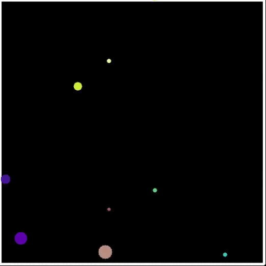

## 2D Particle Collision Simulation

A limited capability 2D particle collision simulator.
Modeling of particle collisions in a 2D space under the  following assumptions:
- Prefectly Elastic Collisions
- The box has infinite mass
- Particles have no acceleration

**Current limitations**
- The number of particles have to be kept <= 20 to keep the simulation smooth,
  since the current collision checking is a brute force method and takes O(n^2) time.
- only round particles has been  modeled as other geometries are complex to model.

### Motivation

I have  been fascinated by physics simulators and game engines for sometime and wanted to try making a small prototype of my own
and this project looked like the perfect opporturnity to try it out.


##Classes

1. **Box**
   - Models the box which contains the particles.

2. **BaseParticle**
   - Models the basic properties of particle

3. **CircleParticle**
   - Derived from BaseParticle , models a round particle 

4. **ParticleGenerator**
   - Generates the values for a creating a particle with random position, velocity , mass and color.

5. **ParticleDynamics**
   - Models the collision dynamics of the particles in a 2D space.
   
6. **Renderer** 
   - Generates the visual output of the collision using OpenCV .
   
7. **Simulator**
   - Handles the creation and manages the simulation loop
   

### Dependencies

1. Eigen `apt install libeigen3-dev`
2. OpenCV `apt install libopencv-dev`

### Building and Running

```
cd ParticleSimulator
mkdir build
cd build
cmake ..
make

# running 

./simulator
```
### Expected output 




## Criterias Completed

**OOP**
- Project uses OOP
- Classes use appropriate access specifiers for class members
- class constructors utilize member initializer lists
- classes abstract implementation details
- 