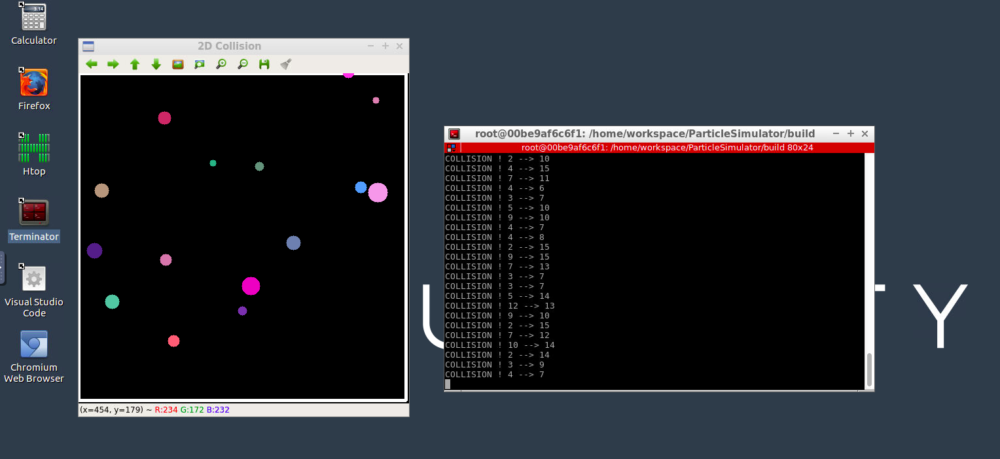
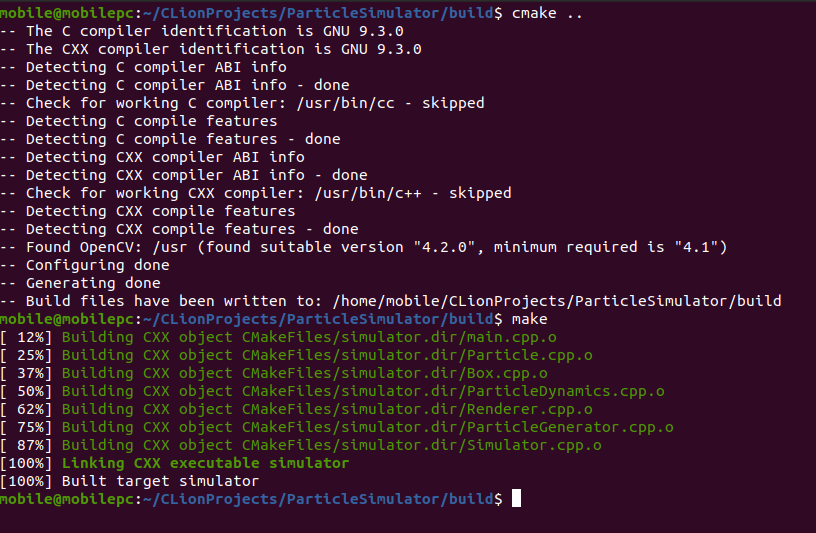

## 2D Particle Collision Simulation

A limited capability 2D particle collision simulator.
Modeling of particle collisions in a 2D space under the  following assumptions:
- Prefectly Elastic Collisions
- The box has infinite mass
- Particles have no acceleration

**Current limitations**
- The number of particles have to be kept <= 20 to keep the simulation smooth,
  since the current collision checking is a brute force method and takes O(n^2) time.
- only round particles has been  modeled as other geometries are complex to model.

### Motivation

I have  been fascinated by physics simulators and game engines for sometime and wanted to try making a small prototype of my own
and this project looked like the perfect opportunity to try it out.


##Classes

1. **Box**
   - Models the box which contains the particles.

2. **BaseParticle**
   - Models the basic properties of particle

3. **CircleParticle**
   - Derived from BaseParticle , models a round particle 

4. **ParticleGenerator**
   - Generates the values for a creating a particle with random position, velocity , mass and color.

5. **ParticleDynamics**
   - Models the collision dynamics of the particles in a 2D space.
   
6. **Renderer** 
   - Generates the visual output of the collision using OpenCV .
   
7. **Simulator**
   - Handles the creation of simulation entities and manages the simulation loop
   

### Dependencies

1. Eigen `apt install libeigen3-dev`
2. OpenCV `apt install libopencv-dev`

### Building and Running

```
cd ParticleSimulator
mkdir build
cd build
cmake ..
make

# running 

./simulator
```

### Expected input
```
Enter the number of particles (min : 1, max 20)  : <Enter number here>
```
### Expected output 

The visualisation of the particles colliding 


## Criterias Completed

**Loops, Functions, I/O**
- The project demonstrates an understanding of C++ functions and control structures.
- The project accepts user input and processes the input.

**OOP**
- The project uses Object Oriented Programming techniques.
- Classes use appropriate access specifiers for class members.
- Class constructors utilize member initialization lists.
- Classes abstract implementation details from their interfaces.
- Classes encapsulate behavior.
- Classes follow an appropriate inheritance hierarchy.
- Overloaded functions allow the same function to operate on different parameters.
- Derived class functions override virtual base class functions.

**Memory Management**

- The project makes use of references in function declarations.
- The project uses scope / Resource Acquisition Is Initialization (RAII) where appropriate.
- The project uses smart pointers instead of raw pointers.


### Excution in project workspace

I developed the project locally on my ubuntu 20.04 machine , and it compiles without any errors or warnings. But the project workspace VM seems to have some issues finding Eigen properly using just find_package().
I have made the necessary changes for it to work in project workpace , and it compiles are runs. ( there seems to be warnings, I am not sure why it happens on the VM)

Attaching an image of working in project space



Compilation on my machine without warings


